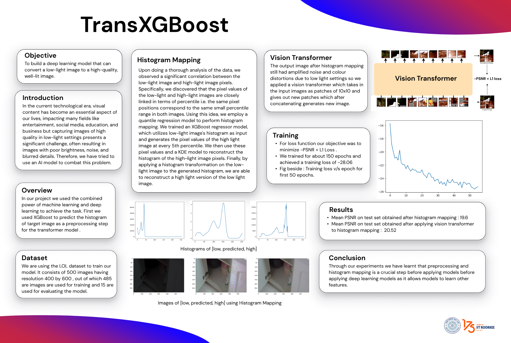

--
<h3>Usage</h3>


1. Install Dependancies
```bash
pip3 install -r requirements.txt
```
2. Run model on custom dataset
```bash
python3 eval.py --output <output-dir> --input <input-dir>
```
3. Training script we used to train out models
```bash
python3 train.py
```
---
We used `LOL-v1` dataset from [Deep Retinex Decomposition for Low-Light Enhancement](https://arxiv.org/abs/1808.04560v1) for training and evaluation. The dataset is added to this repo no need to download it from other sources. 


